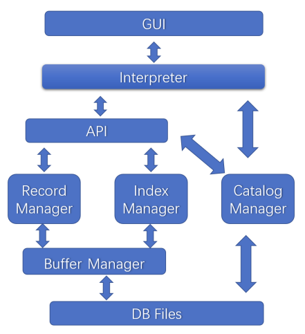

# MiniSQL
This project implemented a Database Management System called *MiniSQL*. It allows users to use SQL statements to 1. create and delete tables; 2. create and delete indices; 3. insert, delete, and select records in the database.

## Dependency

The GUI is written in Python, which requires Tkinter package. Other modules are written in C++, only depending on C++ Standard libraries.

## Build & Run

- Windows
  - Organize all files in `./MiniSQL/src/` into a C++ project, and build a `.dll` file. We provide a pre-built one in `./MiniSQL/bin/win64/`.
  - Place the `.dll` file and the GUI script `./MiniSQL/gui/MiniSQL.pyw` in the same folder.
  - Run `MiniSQL.pyw`.
- Other platforms
  - Our program is able to run on other platforms. You need to build all files in `./MiniSQL/src/` into a a dynamic library file (e.g. `.so` file on Ubuntu), and modify the command in line 12 of `./MiniSQL/gui/MiniSQL.pyw` to load that file (e.g. `dll = ctypes.cdll.LoadLibrary("./MiniSQL.so")` for Ubuntu).
  - The remaining steps are the same as those on Windows.

**Note**: If the GUI cannot display records produced by `select` statement while the message bar (at the bottom of the GUI window) tells the statement is successfully executed, this may be because the program fails to create a `Result` folder to dump temporary data. You need to create a `Result` folder manually in the directory where `MiniSQL.pyw` is placed.

## Usage

Supported statements:

- create table <*TableName*> (<*AttrType*> <*AttrName*> [unique], ..., primary key(<*AttrName*>));
- drop table <*TableName*>;
- create index <*IndexName*> on <*TableName*>(<*AttrName*>);
- drop index <*IndexName*> on <*TableName*>;
- select \* from <*TableName*> where <*condition*>;
  - support point query and range query; do not support nested subquery
- insert into <*TableName*> values (<*Value*>, ...);
- delete from <*TableName*> where <*condition*>;
  - support point query and range query; do not support nested subquery
- quit;
- execfile <*FileName*>;

Supported data types:

- int
- float
- char(<*Length*>)

## Structure

#### Interpreter

`Interpreter` receives and parses strings and calls the corresponding APIs.

#### API

On one hand, this module provides high-level APIs for `Interpreter`. On the other hand, it interacts with underlying modules (`Record Manager`, `Index Manager`, `Catalog Manager`) to finish given tasks.

For example, when `Interpreter` calls the `select` API, this module firstly interacts with `Catalog Manager` to get the meta data of the desired table, then interacts with `Record Manager` or `Index Manager` (if there is an index that can accelerate the query process) to select desired records, and finally return these records to `Interpreter`.

#### Catalog Manager

`Catalog Manager` manages the meta data of tables and indices, including table names, table attribute names, table attribute types, primary keys, etc.

#### Record Manager

`Record Manager` manages the storage of records in the binary file. For example, when a new table is created, `Record Manager` calls `Buffer Manager` to create a new block for the storage of records of that table. When a table is dropped, `Record Manager` calls `Buffer Manager` to delete all the blocks of that table. When executing a `select` statement, `Record Manager` visits every record to find desired ones.

Our system only supports fixed-length records. We use one byte to indicate whether the record is empty or not, and a free-list to link all empty records for each table.

#### Index Manager

`Index Manager` maintains the indices in the database. Each table has at least one index (built on its primary key). An index is internally a B+ tree. It can accelerate the query process for `where` clause. Also, when records are inserted or deleted, `API` not only calls `Record Manager` to update the underlying storage of records, but also calls `Index Manager` to update the B+ trees of involved indices.

#### Buffer Manager

`Buffer Manager` maintains a buffer pool for disk I/O. To reduce the frequency of disk I/O which is very slow, when the system wants to access data at a specific position of the disk, `Buffer Manager` will read the whole block (4KB in our system) and cache it in RAM. Therefore, if the system need to access data in the same block later, it can directly read the memory.

`Buffer Manager` interacts with `Record Manager` and `Index Manager`. It does not interact with `Catalog Manager` because the size of meta data is usually very small.

There are many strategies for buffer swapping (e.g. LRU). We adopt the same strategy as [InnoDB](https://dev.mysql.com/doc/refman/8.0/en/innodb-buffer-pool.html), which is a variation of the LRU algorithm.

## Test Samples

Test samples are placed in `./MiniSQL/test/`.

## Screenshots

## Contributors

- [尤锦江 (Jinjiang You)](https://yjjfish.github.io/)

  Interface Design, Index Manager, Buffer Manager, Record Manager, GUI

- 张之昀

  Interpreter, API, Catalog Manager

- 周宇鑫

  Record Manager, Report
